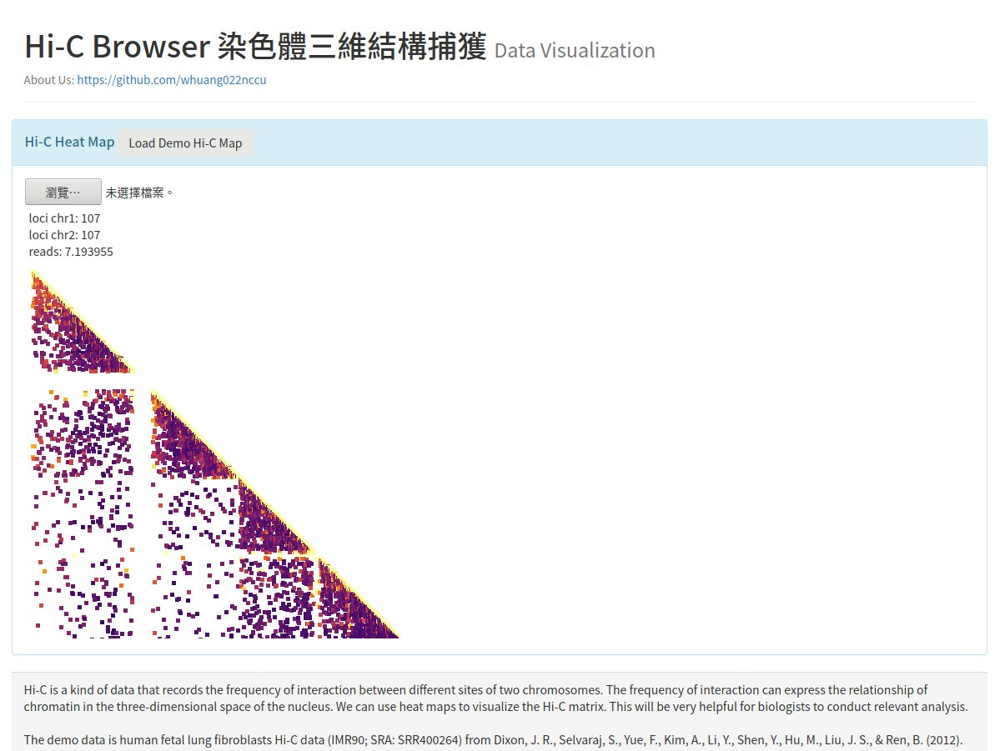

# Hi-C Browser
---
## A Hi-C Map Data Visualization Powered by D3.JS#

## How to Use

#### Step 1

Convert [Hi-C Pro](https://github.com/nservant/HiC-Pro) output **.matrix** to **.csv** format
```
tr '\t' ',' < your_output.matrix > out.csv
```
```
echo 'group,variable,value' | cat - out.csv > temp && mv temp out.csv
```
out.csv will be ready to visualization.
#### Step 2

Upload the **.csv** file , well done!



## Reference

Dixon, J. R., Selvaraj, S., Yue, F., Kim, A., Li, Y., Shen, Y., Hu, M., Liu, J. S., & Ren, B. (2012). Topological domains in mammalian genomes identified by analysis of chromatin interactions. Nature, 485(7398), 376–380. https://doi.org/10.1038/nature11082

Bootstrap,https://getbootstrap.com/
